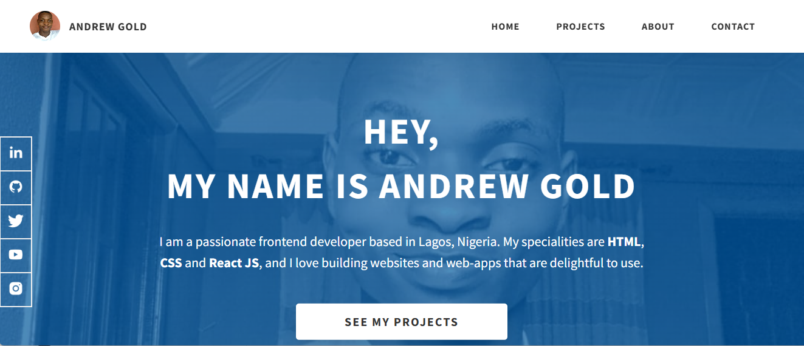
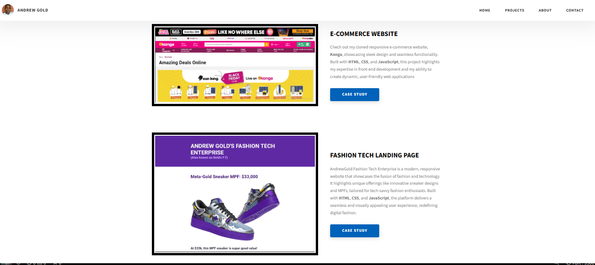
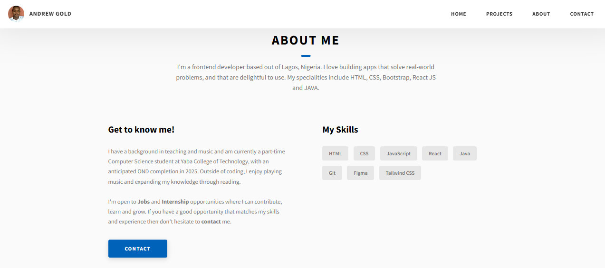

# Portfolio README

## Welcome to My Portfolio!

Hello! I'm Ayemo Andrew Onoriode, a passionate Computer Scientist, Front-End Developer, and Teacher, based in Lagos, Nigeria. This portfolio showcases my journey, projects, and skills in front-end development and beyond. 

---

## About Me

- **Name**: Ayemo Andrew Onoriode  
- **Profession**: Computer Scientist, Front-End Developer, Tech Instructor 
- **Location**: Lagos, Nigeria  
- **Contact**:  
  - **Email**: ayemoandrewgold@gmail.com  
  - **Phone**: +234, 08124106198 
  - **LinkedIn**: [Andrew Gold](https://www.linkedin.com/in/andrew-gold-5094861b5/)  

---

## Skills

- **Front-End Development**: HTML, CSS, JavaScript, Tail-Wind CSS, BootStrap React.js  
- **Programming Languages**: Python, JavaScript  
- **Tools and Technologies**: Git, Visual Studio Code  
- **Other Skills**: Teaching, Problem Solving, Collaboration  

---

## Projects

### 1. **My Google form clone **
- **Description**: This project is a Google Form clone. It replicates the design and functionality of the original Google Forms with customizable form fields and interactive user experience. The clone supports various question types such as short answer, multiple choice, and checkboxes. This project also highlights form validation, dynamic question rendering, and a clean, responsive design that ensures seamless use across devices.
- **Technologies**: HTML, CSS, JavaScript

### 2. **E-commerce website**
- **Description**: This project is a clone of the Konga e-commerce platform, built to showcase my skills in f ront-end web development. The clone replicates key elements of the original website, including its layout, design, and core features.

Features & Functionalities: Responsiveness For different screen size, Homepage: Displays a dynamic product promotional banners. Product Listing Page: Displays products with filters for category, price range, and search functionality. Product Detail Page: Shows detailed information about each product, including images, descriptions, and prices. Shopping Cart: A mock cart that allows users to add and remove products. Responsive Design: The website adapts to different screen sizes and devices, ensuring a seamless experience across desktops, tablets, and mobile phones. Navigation & Search: Functional navigation bar with categories and a search bar for easy product discovery. Technologies Used: Frontend: HTML, CSS, JavaScript Responsive Design: Media queries for mobile-first design Development Tools: Code editor, version control with Git, and hosted on GitHub This project was developed to replicate an e-commerce platform's design and functionalities while honing my skills in building real-world web applications.
- **Technologies**: HTML, CSS, JavaScript

### .3 **A Personal Landing page for my brand **
- **Description**: AndrewGold Fashion Tech Enterprise is a modern, responsive website that showcases the fusion of fashion and technology. It highlights unique offerings like innovative sneaker designs and MPFs, tailored for tech-savvy fashion enthusiasts. Built with HTML, CSS, and JavaScript, the platform delivers a seamless and visually appealing user experience, redefining digital fashion.
- **Technologies**: HTML, CSS, JavaScript

### 4. **Instagram Clone**
- **Description**: A group project to build an interactive Instagram clone using React.js. Currently integrating APIs for a functional home feed and story component.
- **Technologies**: React.js, CSS, REST APIs

### 5. **Rock Papper Scissors Game **
- **Description**: A classic Rock Paper Scissors game implemented with HTML, CSS, and JavaScript. The game allows users to play against the computer, showcasing dynamic updates and user interaction. 
- **Technologies**: HTML, CSS, JavaScript

### 6. **Micro finance Bank **
This project is a simulation of a microfinance banking platform. It features user account creation, balance management, and basic transaction functionalities such as deposits and withdrawals. The goal is to demonstrate core banking operations in a simple, user-friendly interface, focusing on security and usability. The project highlights my ability to implement real-world financial workflows and user authentication.   
- **Technologies**: HTML, CSS, JavaScript

### 7. **FashionTech **
- **Description**: FashionTech is a digital platform dedicated to exploring the intersection of fashion and technology. The project features a modern UI, product showcases, and interactive elements that highlight innovative fashion solutions. It demonstrates my ability to blend aesthetics with functionality, providing users with an engaging experience.
- **Technologies**: HTML, CSS, JavaScript
---

## Experience

- Currently seeking a front-end development internship to grow and learn from industry professionals while contributing value with my skills.

- **Freelance Front-End Developer**  
  Developed responsive websites and landing pages for small businesses and personal brands, focusing on clean UI/UX and performance optimization.

- **Tech Instructor (Volunteer)**  
  Facilitated coding workshops for beginners, teaching HTML, CSS, and JavaScript fundamentals to aspiring developers in local communities.

- **Open Source Contributor**  
  Participated in open-source projects on GitHub, collaborating with global teams to fix bugs, improve documentation, and add new features.

---

## Goals

- Enhance my front-end development expertise.
- Collaborate with professionals to deliver impactful projects.
- Continuously learn and improve in the field of technology.
- Build a strong professional network in the tech industry.
- Contribute to open-source projects and communities.
- Develop full-stack web applications.
- Stay updated with the latest trends and technologies in web development.
- Mentor and inspire aspiring developers.
- Achieve certifications in advanced front-end frameworks.
- Launch my own tech-focused startup or product.
- Participate in hackathons and coding competitions.
- Improve my UI/UX design skills.
- Share knowledge through blogging or public speaking.

---

## How to Use This Portfolio

Feel free to explore the projects and resources here. You can:
- Check out the project demos.
- Review the source code.
- Contact me for collaborations or internship opportunities.

---

## Contributions

I welcome suggestions and contributions to make my work better. Please feel free to reach out via my email or LinkedIn.

---

Thank you for visiting my portfolio! 😊

